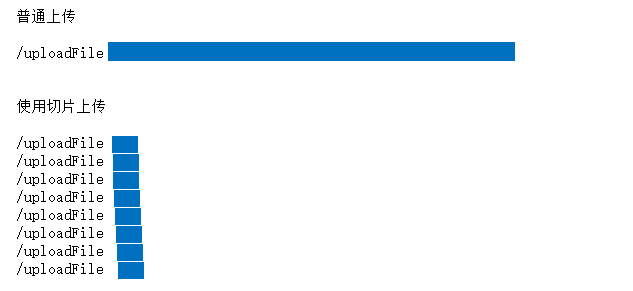

[SSR应用](./README.md) | 大文件上传 | [大文件下载](./READDOWN.md)

`npm install axios spark-md5 @koa/router  koa-bodyparser koa2-multiparty -S --registry=https://registry.npm.taobao.org`

## 实现大文件上传和断点续传


## 前端代码

### 处理获取到的file

```js
let file=event.target.files[0]
```

工具一：将拿到的文件对象转换为`buffer`格式,写一个工具方法

```js
//utils.js
export function fileParse(file, type = "base64") {
    return new Promise(resolve => {
        let fileRead = new FileReader()
        if (type === "base64") {
            fileRead.readAsDataURL(file)
        } else if (type === "buffer") {
            fileRead.readAsArrayBuffer(file)
        }
        fileRead.onload = (ev) => {
            resolve(ev.target.result)
        }
    })
}
```
工具二：[spark-md5](https://www.npmjs.com/package/spark-md5)
> SparkMD5是md5算法的一个快速md5实现。这个脚本基于JKM md5库，这是目前最快的算法。这是最适合浏览器使用的，因为nodejs版本可能更快。

```js
let buffer=fileParse(file);
let spark=await fileParse(file, "buffer"); //要放在在async函数里
spark.append(buffer);
let hash=spark.end();
let suffix = /\.([0-9a-zA-Z]+)$/i.exec(file.name)[1];//文件的格式后缀
```

### 创建切片

```js
//创建100个切片
let partList = [],
	partsize = file.size / 100,
	cur = 0;
for (let i = 0; i < 100; i++) {
	let item = {
		    chunk: file.slice(cur, cur + partsize),
		    filename: `${hash}_${i}.${suffix}`//i是为了在后端按顺序拼接
		};
	cur += partsize;
	partList.push(item);
}
sendRequest();//发送请求
```

### 发送请求
上面创建好切片后就开始执行上传。

```js
async sendRequest() {
	// 根据100个切片创造100个请求（集合）
	let requestList = []
	this.partList.forEach((item, index) => {
	// 每一个函数都是发送一个切片的请求
		let fn = () => {
			let formData = new FormData()
			formData.append("chunk", item.chunk)
			formData.append("filename", item.filename)
			return axios
					.post("/uploadFile", formData, {
						headers: { "Content-Type": "multipart/form-data" }
					})
					.then((result) => {
						result = result.data
						if (result.code == 0) {
							this.total += 1
							// 传完的切片我们把它移除掉
							this.partList.splice(index, 1)
						}
					})
		}
		requestList.push(fn)
	})

	// 传递：并行(ajax.abort())/串行(基于标志控制不发送)
	let i = 0
	let complete = async () => {
		let result = await axios.get("/merge", {
			params: {
				hash: this.hash
			}
		})
         result = result.data
        if (result.code == 0) {
			console.log('上传成功')
		}
	}
	let send = async () => {
		// 已经中断则不再上传
			if (this.abort) return//断点
			if (i >= requestList.length) {
				// 都传完了
				complete()
				return
			}
			await requestList[i]()
			i++
			send()
		}
	send()
}
```

## 后端代码

`/uploadFile`来接受前端传过来的切片数据,并将切片存到本地
```js
router.post('/uploadFile', multiparty(options = {
    maxFieldsSize: 200 * 1024 * 1024
}),async (ctx, next) => {
    const fields=ctx.req.body;
    const files=ctx.req.files;
    let chunk = files.chunk,
        filename = fields.filename;
    let hash = /([0-9a-zA-Z]+)_\d+/.exec(filename)[1],
        // suffix = /\.([0-9a-zA-Z]+)$/.exec(file.name)[1],
        path = `${uploadDir}/${hash}`;
    !fs.existsSync(path) ? fs.mkdirSync(path) : null;
    path = `${path}/${filename}`;
    await new Promise(resolve=>{
        fs.access(path, async err => {
            // 存在的则不再进行任何的处理
            if (!err) {
                ctx.body={
                    code: 0,
                    path: path.replace(__dirname, `http://127.0.0.1:${3000}`)
                };
                resolve()
                return;
            }
            // 不存在的再创建
            let readStream = fs.createReadStream(chunk.path),
                writeStream = fs.createWriteStream(path);
            readStream.pipe(writeStream);
            await new Promise(resolve=>{
                readStream.on('end', async function () {
                    fs.unlinkSync(chunk.path);
                    ctx.body={
                        code: 0,
                        path: path.replace(__dirname, `http://127.0.0.1:${3000}`)
                    };
                    resolve()
                });
            })
            resolve()
            
        });
    })
    
})
```

上传结束后需要调用下merge 告诉服务端所有切片上传了，可以将切片按顺序拼接并保存
```js
router.get('/merge', (ctx) => {
    let {
        hash
    } = ctx.query;
 
    let path = `${uploadDir}/${hash}`,
        fileList = fs.readdirSync(path),
        suffix;
    fileList.sort((a, b) => {
        let reg = /_(\d+)/;
        return reg.exec(a)[1] - reg.exec(b)[1];
    }).forEach(item => {
        !suffix ? suffix = /\.([0-9a-zA-Z]+)$/.exec(item)[1] : null;
        fs.appendFileSync(`${uploadDir}/${hash}.${suffix}`, fs.readFileSync(`${path}/${item}`));
        fs.unlinkSync(`${path}/${item}`);
    });
    fs.rmdirSync(path);
    ctx.body={
        code: 0,
        path: `http://127.0.0.1:${3000}/upload/${hash}.${suffix}`
    };
});
```
